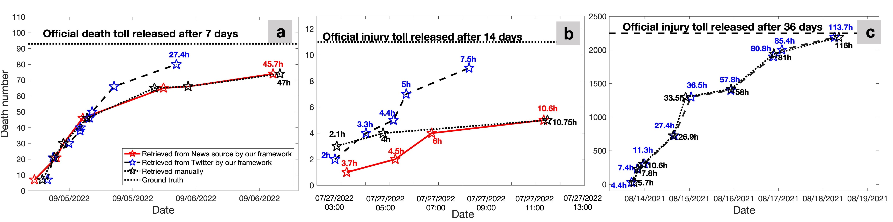

# Hierarchical-Earthquake-Casualty-Information-Retrieval

[Near-real-time Earthquake-induced Fatality Estimation using Crowdsourced Data and Large-Language Models](https://arxiv.org/abs/2312.03755)

<p align="center" width="40%">
<a ></a>
</p>

This is the repo for the hierarchical classifier and information extractor in the Project Human Loss Estimation via LLMs, which introduces a novel methodology for effective automatic earthquake casualty information retrieval from social media by leveraging the LLMs' adavanced ability on natural language understanding.

The repo contains:

- The hierarchical event classifer and human cost imformation extractor we proposed. 
- The code for visualizing models' results.
- The sample output of our models.

(Please feel free to email sxu83[AT]jh[DOT]edu or chenguang[DOT]wang[AT]stonybrook[DOT]edu for any questions or feedback)

## Contents
- [Overview](#overview)
- [Run Code](#run-code)
- [Performance Comparison](#performance-comparison)
- [Prompt](#prompt)
- [ToDo](#todo)
- [Citation](#citation)

## Overview

The framework for near-real-time earthquake-induced fatality estimation hinges on a sophisticated hierarchical data extraction process, designed to tackle the challenges of extracting reliable information from social media and traditional media platforms. This process begins with a hierarchical classifier, based on XLM-RoBERTa and trained on the CrisisNLP dataset, which efficiently filters through the vast sea of noisy crowdsourced data. This classifier identifies earthquake-related information with high accuracy, ensuring that only relevant data is processed.

Once filtered, the relevant data is passed to the extraction module, which utilizes Few-Shot Learning techniques based on GPT-J to retrieve the exact number of earthquake-induced casualties. This allows for accurate extraction of critical data points, such as casualty statistics, without requiring extensive training or fine-tuning.

The hierarchical structure of the classifier ensures that only the most pertinent information is processed, significantly reducing noise and improving data handling efficiency. By leveraging the robust prior knowledge embedded in GPT-J, the framework swiftly adapts to varying linguistic patterns and nuances across different regions, enabling the accurate processing of multilingual text.

In practice, this framework provides rapid and precise estimations of human losses during seismic events, making it invaluable for emergency response teams, governments, and non-governmental organizations. It empowers decision-makers to act promptly based on reliable data, ultimately saving lives and resources in the wake of natural disasters.

## Run code

The code of training the hierarchical classifier and human loss extraction are located respectively in the:
- `code/Hierarchical Event Classifier`
- `code/Human Cost Information Extraction`
  
To get the hierarchical classifier and human loss extraction running, follow these steps:

### Pre-requisites

1. **Docker**: Ensure Docker is installed on your server. If not, install it from [here](https://docs.docker.com/get-docker/).
   
2. **Pull Docker Image**: Download the specific PyTorch Docker image:
   ```bash
   docker pull pytorch/pytorch:1.12.0-cuda11.3-cudnn8-devel
   ```
3. **Run Docker Image**: Start the Docker container with this command:
   ```bash
   docker run -it --name pytorch-container pytorch/pytorch:2.1.0-cuda11.8-cudnn8-devel
   ```
   
### Setup and Installation

1. Clone the GitHub repository to your local machine:
   ```bash
   git clone https://github.com/SusuXu-s-Lab/Hierarchical-Earthquake-Casualty-Information-Retrieval.git
   ```
2. Download the data from [CrsisNLP](https://crisisnlp.qcri.org/lrec2016/lrec2016.html). For convenience, this repository includes the data. Pretrained models can be obtained from [HuggingFace](https://huggingface.co/). The earthquake crowdsourced data not included in the CrisisNLP dataset was gathered through our [Crowdsourced Data Retrival Project](https://github.com/SusuXu-s-Lab/Crowdsourced-Data-Retrival).

3. Navigate to the repository's directory and install the necessary Python dependencies:
   ```bash
   cd Hierarchical-Earthquake-Casualty-Information-Retrieval
   pip install -r requirements.txt
   ```
   
4. Run the code:
  - Update the out_dir and data_dir variables according to your requirements in the code.
  - To change the model, replace the model card from [HuggingFace Models](https://huggingface.co/models)
  - to add data, just place the csv/xlsx/tsv in the data folder and change the file path inside the code accordingly


  To add new data, place the CSV/XLSX/TSV files in the data folder and update the file paths in the code. Once these adjustments are made, run the code: 
  ```bash
  cd [classifier or extraction code folder]
  python [classifier or extraction code file name].py`
  ```
  The results will be available in: `output/[out_dir]`
  
5. Visualization: `visualization.ipynb` visualize the preliminary results. For more detailed visualization with our Dynamic Truth Discovery, please refer to the our [Dynamic Truth Discovery Repo](https://github.com/SusuXu-s-Lab/Dynamic-Truth-Discovery) 

## Performance Comparison

This figure compares fatalities from (a) the 2022 Luding, China earthquake, (b) the 2022 Philippines earthquake, and (c) the 2021 Haiti earthquake. The data, extracted using our framework from Twitter (dashed line with blue markers) and news articles (solid red line), is compared against manually searched data (dashed line with black markers) and the final official toll (black dotted line). Each data point is labeled with the earliest reporting time (UTC). Refer to our paper for the complete results and dicussion.


<p align="center" width="95%">
<a ></a>
</p>

## Prompt
We used the following prompts for few-shot learning to extract inforamtion from crowdsourced data:
```
    Extract casualty statistics from tweets.

    [Tweet]: {Example 1}
    [Query]: |Deaths|Injured|City|Country|Earthquake|
    [Key]: |{death number}|{injury number}|{city name}|{contry name}|{yes or no}|

    ###

    [Tweet]: {Example 2}
    [Query]: |Deaths|Injured|City|Country|Earthquake|
    [Key]: |{death number}|{injury number}|{city name}|{contry name}|{yes or no}|

    ###

    ... 

    ###

    [Tweet]: {Example n}
    [Query]: |Deaths|Injured|City|Country|Earthquake|
    [Key]: |{death number}|{injury number}|{city name}|{contry name}|{yes or no}|

    ###

    [Tweet]: {Tweet from crowdsourced data}
    [Query]: |Deaths|Injuries|City|Country|Earthquake|
    [Key]: 
```

## ToDo
- [x] Include newer crisis data in training 
- [x] Implement our method on latest models. 
- [x] Modify the paper

## Citation
We kindly request that you cite our paper if you find our code beneficial. Your acknowledgment is greatly appreciated.
```
@article{wang2023near,
  title={Near-real-time earthquake-induced fatality estimation using crowdsourced data and large-language models},
  author={Wang, Chenguang and Engler, Davis and Li, Xuechun and Hou, James and Wald, David J and Jaiswal, Kishor and Xu, Susu},
  journal={arXiv preprint arXiv:2312.03755},
  year={2023}
}

@inproceedings{hou2022near,
  title={Near-Real-Time Seismic Human Fatality Information Retrieval from Social Media with Few-Shot Large-Language Models},
  author={Hou, James and Xu, Susu},
  booktitle={Proceedings of the 20th ACM Conference on Embedded Networked Sensor Systems},
  pages={1141--1147},
  year={2022}
}
```
